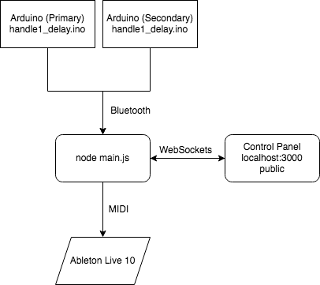

# Chordal Distance

Chordal distance is a musical, interactive installation by Sylvan Zheng and Young-Min Choi.

See [sylvan.fish/chordal_distance](sylvan.fish/chordal_distance) for more details.

## Architecture



Two Arduino microcontrollers receive sensor data (load cell, and 2x 3-axis accelerometer data).
They send this data over Bluetooth to the node.js server running on a central computer.
The node.js server outputs MIDI data to Ableton Live via a virtual MIDI device.
The node.js server also communicates with a front-end control panel accessible by any computer on the local network.

## Requirements

```
venv
python 3.8
nvm/node 16
Arduino
```

## Setup

```
npm install
node main
```
